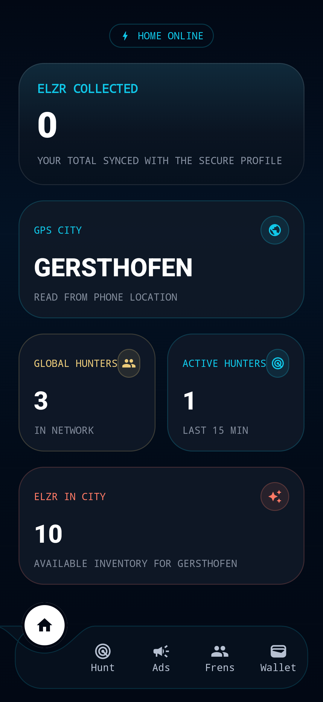
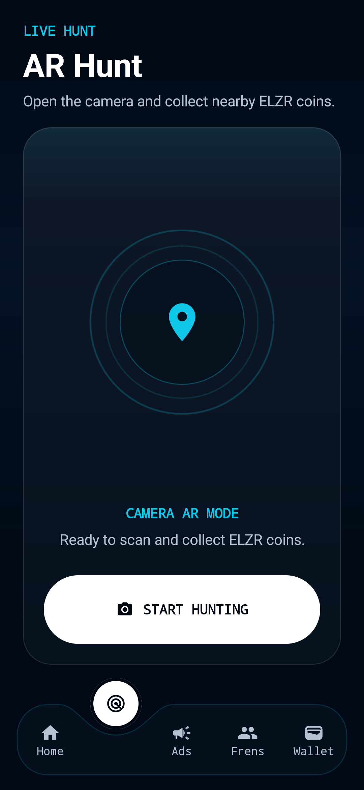
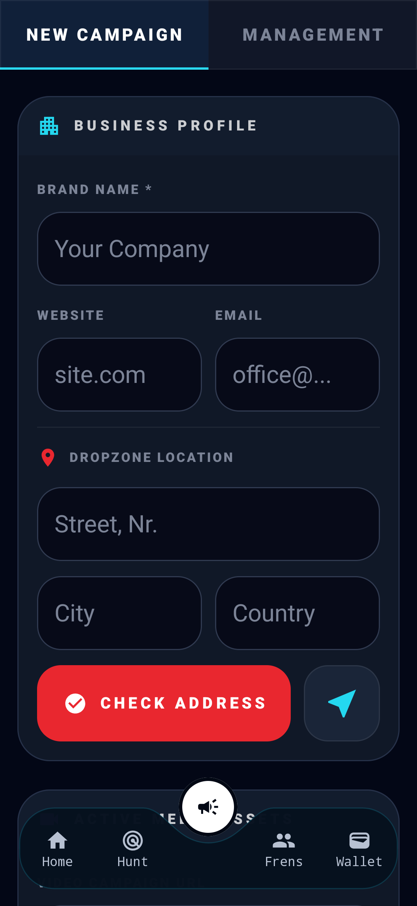
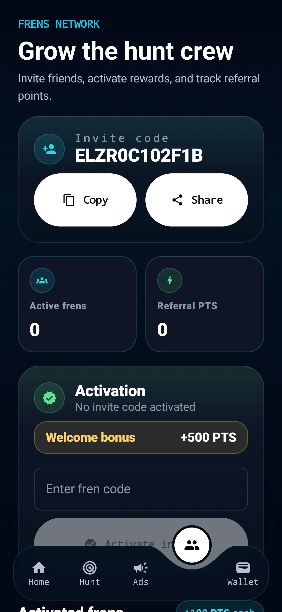
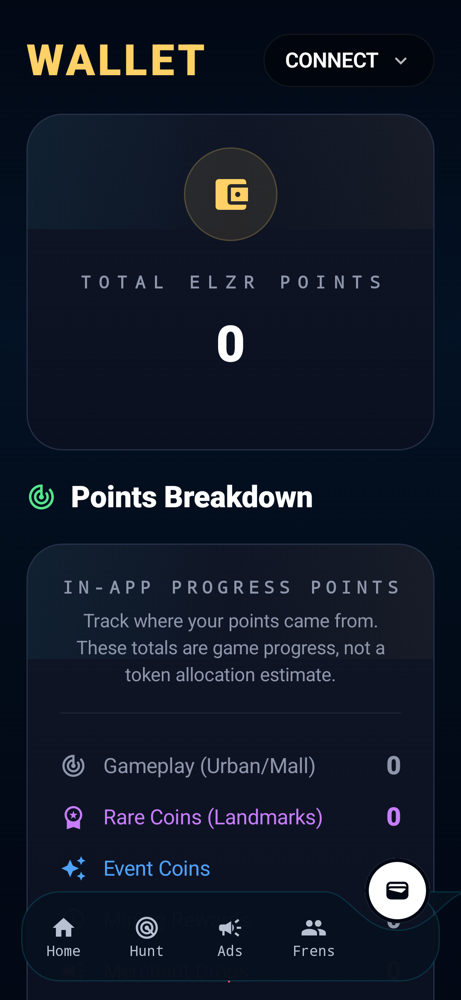

# Eliezer Go

🚀 **Eliezer Go** is an Android test build for early community contributors.

## 📲 Download

👉 [Download the latest APK from Releases](https://github.com/Iulian85/Eliezer-Go/releases/latest)

## 🧪 What to Test

- 🏠 Home dashboard
- 🎯 Hunt screen
- 📷 Camera opening in AR mode
- 📣 Ads flow
- 👥 Frens / referral flow
- 🔐 Biometric registration / login
- 🛡️ Device trust scan result for emulator, root, and GPS spoofing checks
- 💎 TON wallet connection
- 👛 Wallet and Network Mining ELZR
- 📱 App stability on real Android phones

## ⚠️ Current Test Build Notes

- 🎯 AR coin hunting is temporarily disabled in this build.
- 📣 Buying Ads campaigns is temporarily disabled in this build.
- 👛 This test phase focuses on Wallet, Network Mining ELZR, Frens, TON wallet connection, AR camera opening, biometric login, and device trust scan behavior.

## 📝 Project Notes and Articles

- [Project docs and app overview](docs/index.md)
- [Building Eliezer Go, an Android App for Location-Based Discovery](docs/articles/building-eliezer-go.md)

## 💬 Feedback

We are waiting for feedback from testers. Please send screenshots or short videos showing how the app behaves, plus any errors, crashes, or unexpected behavior.

- 💬 Telegram community: [t.me/eliezergocommunity](https://t.me/eliezergocommunity)
- 📣 Official Telegram channel: [t.me/eliezergo](https://t.me/eliezergo)

When reporting, please include your phone model, Android version, country/network type, and what you tested.

## 📸 Screenshots

| Home | Hunt |
| --- | --- |
|  |  |

| Ads | Frens |
| --- | --- |
|  |  |

| Wallet |
| --- |
|  |

## ✅ Install

1. Download the latest APK from Releases.
2. Open the APK on your Android phone.
3. Allow installation from your browser or file manager if Android asks.
4. Open Eliezer Go and follow the in-app permission screens.

Only download APK files from this repository's official Releases page.
